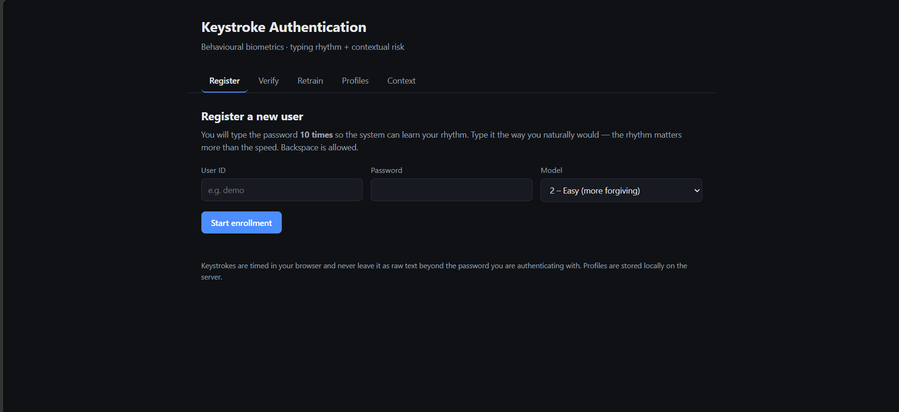
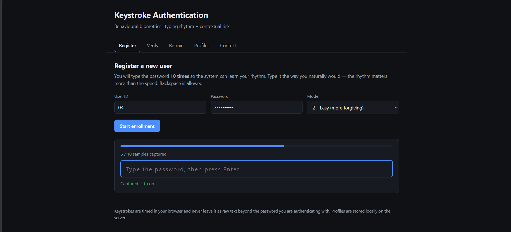
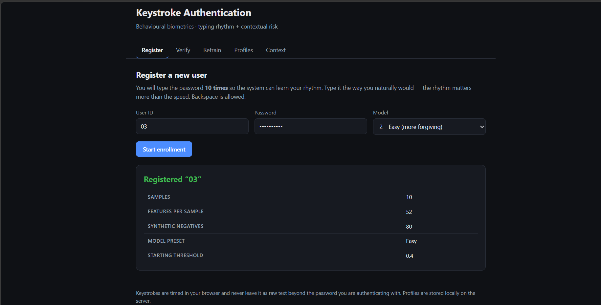
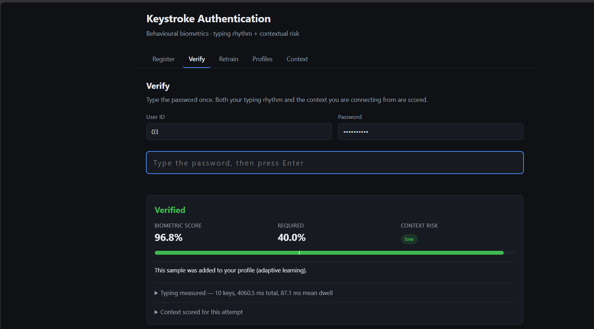
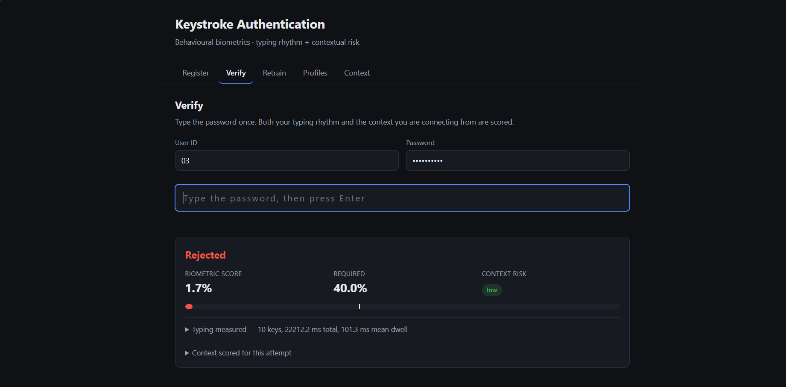
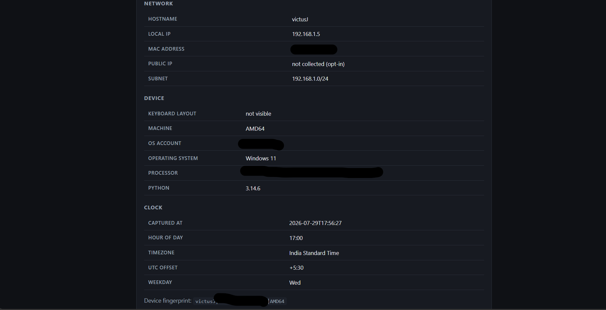
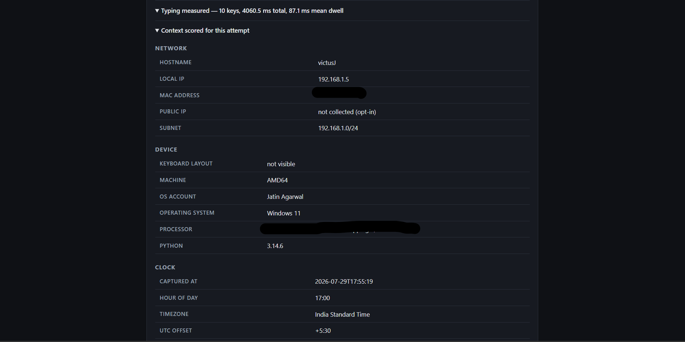
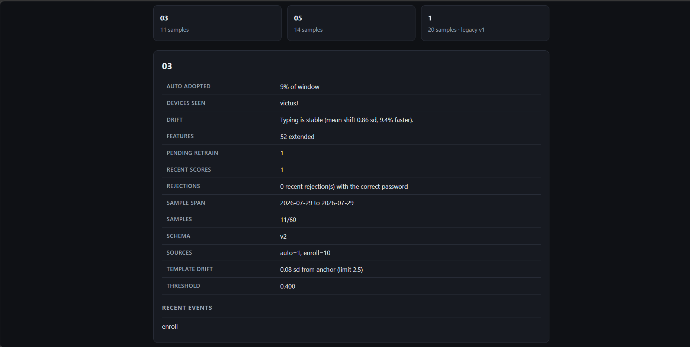
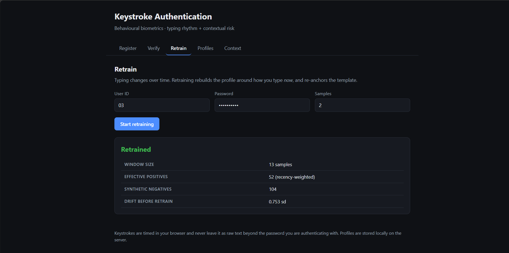

# Keystroke Authentication System

Welcome to the **Keystroke Authentication System**, a cutting-edge security solution that authenticates users based on their unique typing patterns. By measuring keystroke dynamics, such as the time taken between pressing and releasing keys, this system provides an additional layer of security for user authentication.

This system is designed to work with stronger, more complex passwords, as users who are "cyber-aware" tend to use better, more secure passwords. These stronger passwords often come with associated muscle memory from frequent use, which in turn creates distinct keystroke patterns. The logic behind this model is that it performs more effectively with real, well-structured passwords, leveraging the unique typing rhythm that users develop over time when entering such passwords.

This project uses various machine learning models—SVM, KNN, and Random Forest—combined into an ensemble voting classifier. These models are trained to distinguish between legitimate users and impostors based on their typing behavior.

---

## Table of Contents
1. [Introduction](#introduction)
2. [Features](#features)
3. [Installation](#installation)
4. [Web Dashboard](#web-dashboard)
5. [Usage](#usage)
   - [Registering a New User](#registering-a-new-user)
   - [Retraining the User Model](#retraining-the-user-model)
   - [Profile Status and Drift](#profile-status-and-drift)
   - [Verifying a User](#verifying-a-user)
   - [Testing with Existing User Profile](#testing-with-existing-user-profile)
5. [System Architecture](#system-architecture)
6. [Captured Attributes](#captured-attributes)
7. [Machine Learning Models](#machine-learning-models)
8. [Dynamic Threshold Adjustment](#dynamic-threshold-adjustment)
9. [Adaptive Retraining](#adaptive-retraining)
10. [Data Storage and Management](#data-storage-and-management)
11. [Privacy Note](#privacy-note)
12. [Future Enhancements](#future-enhancements)
13. [Demo](#demo)
14. [Reproducing the Demo](#reproducing-the-demo)
15. [Evaluation Status](#evaluation-status)

---

## Introduction

Keystroke dynamics is a biometric technique that identifies users based on how they type. This project captures the user’s typing patterns, processes the data, and classifies the user as authentic or non-authentic based on the keystroke dynamics.

The system includes:
- Keystroke data collection, including press *and* release timings
- Contextual capture of the network, device and clock each sample came from
- User registration
- Adaptive retraining that follows the user's typing as it changes over time
- User verification combining a biometric score with a contextual risk score

## Features

- **Multi-Model Authentication**: Uses SVM, KNN, and Random Forest in a voting classifier to enhance performance.
- **Rich Keystroke Capture**: Records dwell time, down-down, up-down (true flight) and up-up latencies for every key, plus statistical aggregates describing rhythm consistency, typing speed and key overlap.
- **Contextual Capture**: Every sample is stamped with the network, device and clock context it was typed in (IP, subnet, hostname, MAC, OS, timezone, hour of day, keyboard layout).
- **Risk-Based Verification**: Contextual attributes form a second decision layer alongside the biometric score, so an unfamiliar device or network raises the bar rather than passing unnoticed.
- **Dynamic Thresholding**: Adjusts the acceptance threshold from the user's own score history, sitting at the lower edge of their genuine distribution.
- **Adaptive Retraining**: The profile follows the user's typing as it changes — a sliding window, recency weighting, automatic adoption of confident logins, and drift detection.

## Installation

To get started with the Keystroke Authentication System, follow these steps:

### Prerequisites
- Python 3.8 or newer
- `numpy`, `scikit-learn`, `pynput` (`pickle` and `os` are part of the standard library and need no installation)

### Clone the Repository
```bash
git clone https://github.com/aarshx05/Behavioural_Secure_Authentication_.git
cd Behavioural_Secure_Authentication_
```

> Note the trailing underscore in the directory name — it is part of the repository name.

### Install dependencies

A virtual environment is recommended so the packages do not land in your system Python:

```bash
python -m venv .venv

# Windows (PowerShell)
.venv\Scripts\Activate.ps1
# macOS / Linux
source .venv/bin/activate

pip install -r requirements.txt
```

### Running the Program

Two interfaces are available. **The web dashboard is the recommended one** — see [Web Dashboard](#web-dashboard) for why.

```bash
python webapp.py          # web dashboard at http://127.0.0.1:5000
python keystroke_auth.py  # terminal interface
```

The terminal interface shows this menu:

```plaintext
Welcome to the Keystroke Authentication System!

Select an option:
1. Register a new user
2. Retrain an existing user model
3. Verify an existing user
4. Profile status and drift report
5. Exit
```

---

## Web Dashboard

```bash
python webapp.py
```

Then open <http://127.0.0.1:5000>. Four tabs: **Register**, **Verify**, **Retrain**, **Profiles**.

Everything below the transport layer — features, models, risk, drift, storage — is shared with the CLI. Only the way keystrokes are captured differs, and that difference matters:

| | Terminal (`keystroke_auth.py`) | Browser (`webapp.py`) |
|---|---|---|
| Timing source | `pynput` global keyboard hook | `keydown` / `keyup` events |
| OS permissions | Accessibility / Input Monitoring on macOS | None |
| Wayland / headless | Unsupported | Works anywhere a browser runs |
| Password on screen | Echoed in the terminal | Masked (`type="password"`) |
| Startup race | Hook must be live before typing | None — listeners attach synchronously |
| Clock | `time.time()` | `performance.now()`, monotonic |

The browser also gives per-sample progress, a score meter showing where you landed relative to the required threshold, and the contextual risk factors as a list.

Two details worth knowing:

- **Auto-repeat is ignored.** Holding a key fires `keydown` repeatedly, but only one physical press occurred.
- **Paste is blocked** in the typing boxes. A pasted password produces a flawless-looking sample containing no keystrokes at all.

If you serve the dashboard beyond `localhost` (`--host 0.0.0.0`), the risk layer uses the *client's* address and user agent rather than the server's, so remote logins are scored against the device they actually came from. Note that this is Flask's development server and the password is sent in the request body — put it behind TLS before exposing it to a real network.

---

### Platform notes

These apply to the **terminal** interface only; the web dashboard has none of these constraints.

`pynput` reads keystrokes globally, which some operating systems restrict:

| Platform | Requirement |
|---|---|
| Windows | Works out of the box. If launched from an elevated terminal, keystrokes from non-elevated windows may not register |
| macOS | Grant your terminal **Input Monitoring** and **Accessibility** permission under System Settings → Privacy & Security, then restart the terminal |
| Linux | Requires an X11 session. Under Wayland, `pynput` cannot capture global key events — run in an Xorg session, or use `XDG_SESSION_TYPE=x11` |
| SSH / headless | Not supported — there is no keyboard to read |

Type the password into the **same terminal window** that is running the program. The password is echoed as you type, so avoid capturing your real password in screen recordings — use a throwaway password for any demo.

## Usage

The system provides a command-line interface (CLI) for interacting with the authentication system. Upon running the program, you will see the following options:

```plaintext
1. Register a new user
2. Retrain an existing user model
3. Verify an existing user
4. Profile status and drift report
5. Exit
```

### Registering a New User
To register a new user, follow these steps:
1. Enter the user ID (unique identifier for the user).
2. Enter the user's password.
3. The system will prompt you to type the password multiple times to gather sufficient data.
4. After collecting the keystroke data, the system will generate synthetic non-authentic data and train a machine learning model for that user.

### Retraining the User Model
Typing changes. A password typed for the first time this week is slow and deliberate; the same password six months later is muscle memory. A profile frozen at enrollment drifts away from its owner, and the false rejection rate climbs until the user gives up.

Retraining keeps the profile tracking the user:
1. Enter the user ID and password.
2. The system reports how far your typing has drifted since the profile was built.
3. New samples are collected and merged into a **sliding window** of your most recent typing — samples beyond the window are dropped rather than kept forever.
4. Within that window, recent samples are **weighted more heavily** than older ones (a sample one half-life old counts half as much).
5. The model is refit and the profile is re-anchored.

Most of this happens without being asked. See [Adaptive Retraining](#adaptive-retraining).

### Profile Status and Drift
Option 4 reports the state of a profile: window size and age span, where samples came from, the current threshold, how far the template has moved from its anchor, devices seen, and whether your typing has drifted far enough to justify a retrain.

### Verifying a User
To verify a user:
1. Enter the user ID and password.
2. The system will compare the entered password's keystroke dynamics with the stored model for that user.
3. Based on a dynamic threshold, the system will classify the user as authentic or non-authentic.

### Testing with Existing User Profile

(**Note:** This system is designed to work with stronger, more complex passwords, as users who are "cyber-aware" tend to use better, more secure passwords but this simple password will be good for you to understand how it works)

For testing purposes, you can log in using a pre-existing user profile with the following credentials:
- **User ID**: `1`
- **Password**: `a123`

Try logging in with this profile to see how the system works in real-time.

> This profile predates the extended feature set, so it loads as **schema v1** and verifies against the original feature layout. It will not show contextual risk, adaptive learning or drift reporting — those need a v2 profile. Register a new user (or retrain this one, which offers to upgrade it) to exercise the newer features, and for any demo captures.

---

## System Architecture

Verification runs as two independent layers. The biometric layer decides **how**
the password was typed; the contextual layer decides whether **where and when**
looks normal. Neither can override the other — context raises or lowers the bar
the biometric score has to clear.

```plaintext
                        Type password
                              |
              +---------------+---------------+
              v                               v
    +--------------------+          +---------------------+
    |  Keystroke timings |          | Context snapshot    |
    |  hold / DD / UD/UU |          | IP, device, clock   |
    +--------------------+          +---------------------+
              |                               |
              v                               v
    +--------------------+          +---------------------+
    | Voting classifier  |          | Risk assessment     |
    | -> match score     |          | -> risk score       |
    +--------------------+          +---------------------+
              |                               |
              +---------------+---------------+
                              v
                  +-------------------------+
                  | required = threshold    |
                  |          + risk penalty |
                  +-------------------------+
                              v
                     score >= required ?
                       /            \
                    yes              no
                     |                \
                     v                 v
        +-------------------+       Reject
        | Authenticate      |
        +-------------------+
                     |
         confident AND low risk AND
         template near its anchor ?
                     |
                    yes
                     v
        +-------------------------------+
        | Adopt sample -> refit profile |
        +-------------------------------+
```

---

## Captured Attributes

**Timing attributes** (these form the machine learning feature vector, length `4n + 12` for an `n`-character password):

| Attribute | Meaning |
|---|---|
| `hold` | Dwell time — how long each key stays down |
| `dd` | Down-down latency between consecutive keys |
| `ud` | True flight time: previous key released → next pressed. Negative values mean the keys overlapped, which is the rollover typing fast touch-typists produce and hunt-and-peck typists never do |
| `uu` | Up-up latency between consecutive releases |
| aggregates | mean/std/min/max dwell, mean/std of each latency, rhythm consistency (coefficient of variation), typing speed, key overlap ratio |

Only `hold` and `dd` existed previously; release timestamps were captured and discarded.

**Contextual attributes** (recorded per sample, scored separately — *not* in the feature vector):

| Attribute | Attribute |
|---|---|
| Local IP and `/24` subnet | Hostname |
| Public IP *(opt-in)* | MAC address |
| OS name, release, version | Machine and processor |
| Timezone and UTC offset | Hour of day and weekday |
| OS username | Keyboard layout |

### Why context is not in the feature vector

It is tempting to append the IP to the feature array. That fails for three reasons:

- Context is **constant during enrollment**, so the classifier would learn "local IP is 192.168.1.7 ⇒ authentic". That is trivially spoofable, and it collapses the moment the user switches to Wi-Fi, a VPN, or a new DHCP lease.
- Context is **categorical**. Standard-scaling an encoded IP is meaningless, and the synthetic negative generator perturbs *timings* — adding Gaussian noise to an encoded hostname produces nothing an impostor would ever look like.
- A user's network legitimately changes **far more often** than their typing rhythm, so context belongs on a slower, separate axis.

So context is scored on its own axis and used to adjust the bar the biometric score must clear. An unfamiliar device does not prove an impostor, so by default it demands stronger biometric evidence rather than hard-blocking; set `RISK_BLOCK_ENABLED` to refuse high-risk contexts outright.

---

## Machine Learning Models

The system uses an ensemble of three machine learning models:

1. **Support Vector Machine (SVM)**: An RBF-kernel SVM, wrapped in `CalibratedClassifierCV` to produce probabilities.

2. **K-Nearest Neighbors (KNN)**: Classifies data points based on their proximity to other points, with distance weighting. The number of neighbors varies with the chosen preset.

3. **Random Forest (RF)**: A flexible, high-performing model that works well with larger datasets. It creates multiple decision trees and outputs the class that is the mode of the individual trees.

**Voting Classifier**: These three models are combined using a "soft" voting mechanism, meaning that the prediction probabilities of each model are averaged, and the final decision is made based on the highest probability.

### Why both presets use an RBF kernel

The two presets ("Harsh" and "Easy") differ in strictness — regularisation, neighbour count, tree depth — not in kernel. Earlier versions gave "Harsh" a **linear** kernel, which cannot work here: the synthetic negatives surround the authentic cluster in every direction, and no hyperplane separates a blob from a shell enclosing it. Measured on simulated typists, the linear kernel scored genuine samples at ~0.53 against RBF's ~0.73, dragging the ensemble down from ~0.82 to ~0.76.

### Synthetic negatives

Negatives are built in raw timing space and the feature vector re-derived from them, so aggregate features always stay consistent with the per-key values they summarise. Six impostor archetypes are generated:

| Archetype | Models |
|---|---|
| `jitter` | someone typing the password almost right — the hard negative |
| `slow` / `fast` | typists at a different tempo |
| `flat` | uniform intervals: scripted or replayed input |
| `shuffle` | the user's own intervals in the wrong order |
| `random` | broad draws across a plausible human range |

`shuffle` matters most: it has the same overall speed as the genuine user but the wrong rhythm, which forces the model to learn rhythm rather than tempo. Removing it lets a same-speed impostor's score jump from 0.002 to 0.352.

Negatives are regenerated from scratch on every retrain at a fixed ratio to the positive count, rather than accumulated — the earlier approach stacked new negatives onto stored ones each time, so 10 samples became 2,500 negatives after two retrains.

---

## Dynamic Threshold Adjustment

The system adjusts the acceptance threshold from the user's own score history, so users who type slightly differently on different occasions are not falsely rejected.

- **Initial Threshold**: A static threshold (default: 0.4) is used until 5 scores have been recorded.
- **Dynamic Adjustment**: The threshold is placed at the **lower edge** of the user's genuine score distribution — `mean − k × std` of recent successful attempts — and clamped to a sane range. `k` is widened while the history is short, so a handful of unusually consistent logins cannot set a bar the user then struggles to clear.

> **Note on an earlier bug.** Previous versions computed `mean + std`. Because only scores *above* the threshold are ever recorded, that mean is high by construction, and adding a standard deviation pushed the bar above almost every future genuine attempt. The threshold ratcheted upward on each success until the real user was locked out. The bar belongs below the genuine mean, not above it.

Recorded scores are cleared on a **manual** retrain, where the user has deliberately supplied new typing. They are *not* cleared on an automatic refit: that fits nearly the same window plus a few samples, so previous scores still describe the model closely — and clearing on every fifth login would stop the history ever reaching the length the dynamic threshold needs, pinning the bar at the static value permanently.

---

## Adaptive Retraining

Retraining is not only a manual action. Three mechanisms keep the profile tracking the user:

1. **Sliding window with recency weighting.** Only the newest samples are kept, and recent ones dominate the fit. Recency is expressed by *replicating* recent rows rather than via `sample_weight`, because `VotingClassifier` only forwards sample weights when every estimator accepts them — and `KNeighborsClassifier` does not.

2. **Auto-adoption.** A verification that is confidently genuine and comes from an ordinary context is folded back into the profile, so everyday logins become the training data. After a few adoptions the model refits automatically.

3. **Drift detection.** The oldest and newest samples in the window are compared, measured in standard deviations of the profile's own spread — so a naturally variable typist is not flagged for variation that is normal for them.

4. **Rejected-attempt analysis.** Drift measured over stored samples can only see logins that were *accepted*. Once a user's typing moves far enough to start being rejected, nothing new is adopted and that measure goes blind — it will keep reporting "stable" while the user is locked out. Rejected attempts that supplied the correct password are therefore analysed too.

### Drift or attack?

Repeated rejections with a correct password have two very different causes, and the system must not confuse them:

| Evidence | Diagnosis | Told to the user |
|---|---|---|
| Attempts cluster tightly around one new rhythm | The user's own typing has changed | "Your typing appears to have changed — retrain to catch up" |
| Attempts are scattered and inconsistent | Several different people with the password | "That looks like different people — consider changing the password" |

Cohesion — how tightly the rejected attempts agree with each other, relative to the profile's own spread — is what separates the two. Rejected attempts are kept **for reporting only and are never fed to the model**; retraining still requires the password and freshly captured typing.

### Guarding against template poisoning

Auto-adoption is a write path into the model, so it has three independent guards:

- a sample must clear an **absolute confidence floor** *and* beat the bar it was judged against by a margin — merely passing verification is not enough to become training data;
- the **context must look ordinary**, so a login from an unrecognised device never teaches the model anything;
- the window centroid must stay within a bounded distance of the **anchor** recorded at the last password-verified enroll/retrain.

The third guard exists because the per-sample checks alone cannot stop a *walk attack*: an attacker who can pass verification nudging the template toward their own typing a little at a time. Past the bound, auto-adoption stops and an explicit retrain is required to re-anchor. Authentication still works while locked out — only learning pauses.

A share-of-profile cap cannot do this job: the window slides, so enrollment samples age out and the profile legitimately becomes mostly auto-adopted, which would disable adaptation permanently.

---

## Data Storage and Management

All user-related data is stored locally in the `user_data/<user_id>/` folder:

| File | Contents |
|---|---|
| `metadata.pkl` | Schema version, password, feature spec, counters, template anchor |
| `model.pkl` | Trained voting classifier |
| `scaler.pkl` | Fitted scaler for normalizing keystroke data |
| `authentic_data.npy` | Authentic keystroke samples, oldest row first |
| `synthetic_data.npy` | Most recently generated negatives |
| `sample_meta.pkl` | Per-sample timestamp, source (`enroll`/`retrain`/`auto`) and context |
| `context_history.pkl` | Network/device/clock contexts seen for this user |
| `match_probabilities.pkl` | Recent genuine match scores |
| `recent_failures.pkl` | Rejected attempts that had the correct password (reporting only) |
| `history.pkl` | Enrollment / retrain / drift event log |

### Backwards compatibility

Profiles written by earlier versions carry only `{'password': ...}` in `metadata.pkl`. They load as **schema v1** and keep using the original `2n`-length feature layout, so they verify against the model they were actually fit on. The extended feature vector is a strict superset — its first `2n` entries are byte-identical to v1 — so nothing about the old layout had to change. Retraining a v1 profile offers to upgrade it; because v1 never recorded key-release times, the upgrade rebuilds the window from freshly captured typing.

---

## Privacy Note

Contextual capture is **local by default**. Hostname, LAN IP, MAC, OS, timezone and keyboard layout are read from the machine; determining the LAN IP opens a UDP socket against an RFC 5737 documentation address, which performs a routing-table lookup and transmits nothing.

Public IP lookup is the one exception: it contacts a third-party service, so it is **disabled by default**. Enable it with `ENABLE_PUBLIC_IP_LOOKUP` in `bauth/config.py`.

---

## Future Enhancements

The system is functional, but there are several areas for improvement:

1. **Hash the stored password**: `metadata.pkl` still holds the password in plaintext, which is a significant weakness in an authentication project. It should be salted and hashed.

2. **Advanced User Feedback**: Real-time feedback on typing patterns, and suggestions to help users adjust their typing for better recognition.

4. **Real impostor data**: Negatives are currently synthetic. Evaluating against genuine impostor attempts — other people typing the same password — would give trustworthy FAR/FRR figures.

5. **Feature selection**: A long password produces a high-dimensional vector from few samples. Dimensionality reduction or per-feature stability weighting may help.

6. **Free-text keystroke dynamics**: Continuous authentication during a session, rather than only at the login prompt.

---

## Demo

All screenshots are from the web dashboard, captured on Windows 11. Some device identifiers are redacted.

### 1. The dashboard



Five tabs: Register, Verify, Retrain, Profiles and Context. The model selector chooses between the **Harsh** (stricter) and **Easy** (more forgiving) presets, which differ in regularisation, neighbour count and tree depth.

### 2. Enrollment



The password is typed ten times. Each accepted sample advances the bar; a mistyped or incompletely captured attempt is rejected with a reason and does not count. The field is `type="password"`, so nothing is echoed on screen, and paste is blocked — a pasted password would produce a flawless-looking sample containing no keystrokes at all.

### 3. Profile built



The 10-character password yields **52 features** per sample (`4n + 12`) and **80 synthetic negatives** at the 8:1 ratio. Note the imbalance this implies — 52 dimensions learned from 10 genuine samples. See [Evaluation status](#evaluation-status).

### 4. Genuine verification



Scored **96.8%** against the required **40.0%**. The meter shows where the score landed; the tick mark is the threshold. Context risk is `low` because the device and network match what the profile has already seen.

The note *"This sample was added to your profile"* is adaptive learning: the score cleared both the absolute floor and the margin over the required bar, and the context was ordinary, so the sample became training data. Five such adoptions trigger an automatic refit.

### 5. Impostor rejected



The same correct password typed with a deliberately different rhythm — one finger, hunting for each key. Scored **1.7%**.

The interesting part is *why*. Compare the two attempts:

| | Genuine | Impostor |
|---|---|---|
| Keys | 10 | 10 |
| Total time | 4,060 ms | 22,212 ms |
| Mean dwell | 87.1 ms | 101.3 ms |

Mean dwell barely moved — about 16% — while total time grew **5.5×**. Nearly all of the discrimination came from the intervals *between* keys, not from how long each key was held. This is what the `shuffle` negatives are for: they keep the tempo and scramble the order, forcing the model to learn rhythm rather than raw speed.

### 6. What context is captured



Everything the risk layer can see, grouped into network, device and clock. Public IP shows `not collected (opt-in)` because the lookup contacts a third-party service and is disabled by default. Keyboard layout reads `not visible` because the browser does not expose it — the terminal interface can read it, the web one cannot, and the field says so rather than guessing.

These attributes are **not** in the machine learning feature vector. See [Why context is not in the feature vector](#why-context-is-not-in-the-feature-vector).

### 7. Context attached to a verification



Each verification records the exact context it was scored against, alongside what was measured about the typing itself — key count, total duration, mean dwell and any corrections. This is what the risk layer compares on the next login.

### 8. Profile status and drift



Three profiles: two current and `1`, the bundled demo profile, correctly flagged **legacy v1**.

The detail view shows the window (`11/60`), where the samples came from (`auto=1, enroll=10`), the current threshold, and two separate drift measurements:

- **`template drift: 0.08 sd from anchor (limit 2.5)`** — how far the profile has moved from its last password-verified state. This is the anti-poisoning bound.
- **`drift: Typing is stable (mean shift 0.86 sd, 9.4% faster)`** — whether the user's rhythm is changing over time.

`rejections: 0 recent rejection(s) with the correct password` is the third signal: repeated rejections by someone who knows the password are analysed separately, because drift measured over stored samples can only see logins that were *accepted*.

### 9. Retraining



Retraining rebuilds the profile around current typing and re-anchors the template.

**Effective positives (52) exceed the window size (13)** because recent samples are replicated up to 4× — that is how recency weighting is applied. It is done by replication rather than `sample_weight` because `VotingClassifier` only forwards sample weights when *every* estimator accepts them, and `KNeighborsClassifier` does not.

`drift before retrain: 0.753 sd` records how far the typing had moved before the rebuild.

---

## Reproducing the demo

```bash
python webapp.py     # then open http://127.0.0.1:5000
```

Use a throwaway password — one with a capital and a symbol exercises the Shift handling. Register, then verify a few times.

Three cases will not occur on their own:

| Case | How to produce it |
|---|---|
| **Impostor** | Have someone else type it, or type it one-finger with long pauses |
| **Elevated risk** | Change network — a phone hotspot changes the subnet. Or run `python webapp.py --host 0.0.0.0` and open it from your phone, which the risk layer sees as a different client |
| **Drift** | Real drift takes months. Type noticeably faster than you enrolled and repeat until it fails; the drift verdict appears around the third consecutive failure |

Typing *inconsistently* instead — a different rhythm each attempt — produces the `attack` verdict rather than `drift`. Both branches are worth seeing.

---

## Evaluation status

**The numbers in this README come from synthetic impostors, not real ones.** They should be read as demonstrations that the system works end to end, not as security claims.

The classifier is trained on negatives generated from the user's own samples. Any measured separation therefore describes how well it distinguishes real typing from *that generator*, which is not the same question as how well it resists a human attacker. The 96.8% / 1.7% split above is a real measurement of a real typing difference, but it is one person, one password, one session.

Not yet done, in rough order of importance:

- **No FAR / FRR / EER or ROC/DET curves.** These are the standard metrics for the field and none are reported.
- **No real impostor data.** Other people typing the same password is what a test set has to be.
- **No public benchmark.** The CMU keystroke dynamics dataset (Killourhy & Maxion, DSN 2009 — 51 subjects × 400 repetitions) is the usual reference point, and GREYC and Clarkson II exist for cross-dataset and longitudinal work.
- **No baselines.** Killourhy & Maxion found scaled Manhattan distance reached roughly 0.096 EER, beating several ML classifiers. An ensemble that cannot beat a distance metric would be worth knowing about.
- **No held-out evaluation.** Training uses the whole window; there is no cross-validation.
- **Roughly 30 hand-set constants** in `bauth/config.py` — negative ratio, drift thresholds, adoption bars, risk weights — tuned against simulated typists rather than fitted to data.

The adaptive retraining and template-drift bound are the parts most worth studying properly, since template aging is an open problem and the poisoning bound is currently asserted rather than measured against an adaptive adversary.

---

### Author
**[Aarsh Chaurasia - aarsh.chaurasia.201007@gmail.com]**

If you have any questions or would like to contribute, feel free to reach out.
